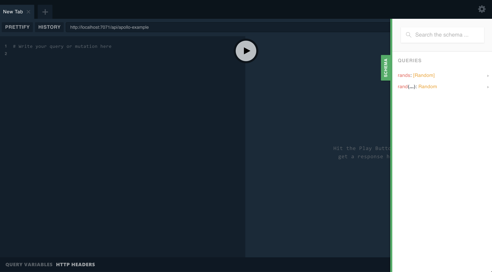
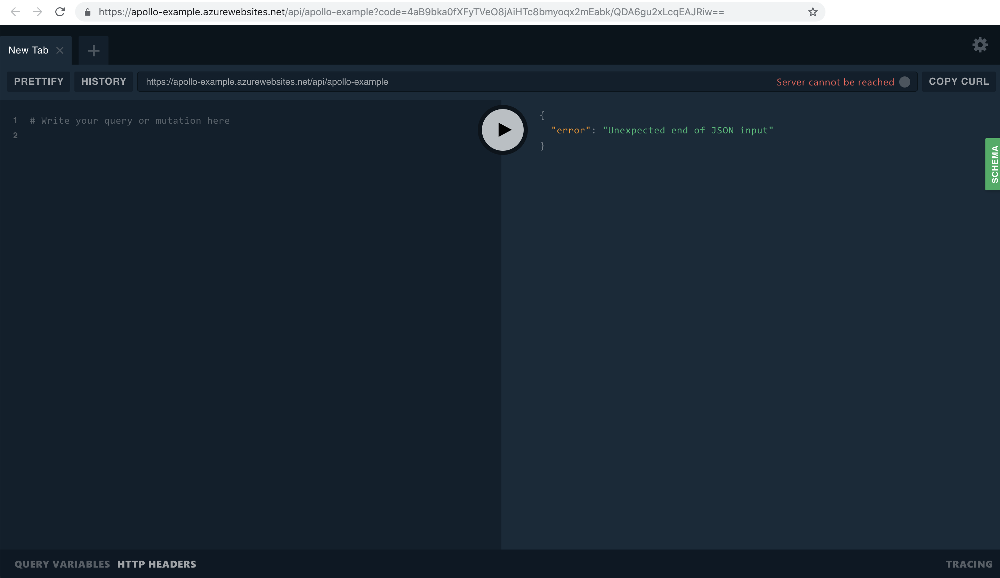
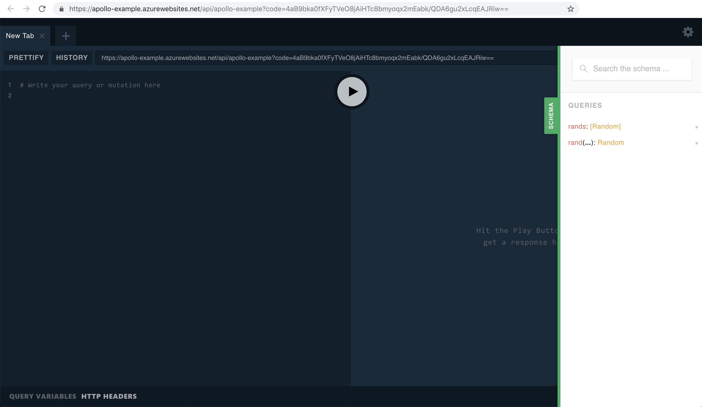

This is the Azure Functions integration for the Apollo community GraphQL Server. [Read Docs](https://www.npmjs.com/package/apollo-server-azure-functions)

All examples below was created using Linux environments, if you are working with Windows-based platforms some commands couldn’t work fine.

## Prerequisites

The following must be done before following this guide:

- Setup an [Azure](https://azure.com) account.
- [Install the Azure CLI 2.0.x](https://docs.microsoft.com/en-us/cli/azure/install-azure-cli?view=azure-cli-latest).

### Detailed versions

To make sure that we are using the same CLI version run the `az --version` and `func --version` commands. My current `az` version is `2.0.52` and my `func` version is `2.3.199`.

## Setting up the project

Before deploying, a new application must be setup. To do this, we need to create some azure requirements. First, you will need a resource group, to create one run the code below on your terminal, where the **--name** is the name for the group and **--location** the region.

```shell
az group create --name apollo-examples --location eastus
```

After creating a resource group, we need to create a storage account to store our code on Azure.

```shell
az storage account create \
    --name apolloexample \
    --location eastus \
    --resource-group apollo-examples \
    --sku Standard_LRS
```

We will need to create our local project, installing the node.js dependencies and testing locally to make sure that all process will happen fine.

```shell
func init apollo-example --worker-runtime node
cd apollo-example
func new --template "Http Trigger" --name apollo-example
```

Now, our project is prepared to start! Run `func host start` command to see the output below.

```shell
Hosting environment: Production
Content root path: /root/apollo-example
Now listening on: http://0.0.0.0:7071
Application started. Press Ctrl+C to shut down.

Http Functions:
        apollo-example: [GET,POST] http://localhost:7071/api/apollo-example
```

Go to [http://localhost:7071/api/apollo-example?name=Apollo](http://localhost:7071/api/apollo-example?name=Apollo) and verify if the text with the content: **Hello Apollo** is appearing at your browser.

## Sample Code

We will now install the dependencies and test our azure function app using apollo server and graphql. Run the following commands to perform the node.js initialization project and to install the node.js dependencies.

```shell
cd apollo-example
npm init -y
npm i apollo-server-azure-functions graphql
```

Copy the code below and paste at you **index.js** file.

```javascript
const { ApolloServer } = require('apollo-server-azure-functions');

const typeDefs = `
  type Random {
    id: Int!
    rand: String
  }

  type Query {
    rands: [Random]
    rand(id: Int!): Random
  }
`;

const rands = [{
    id: 1,
    rand: 'random'
}, {
    id: 2,
    rand: 'modnar'
}];

const resolvers = {
    Query: {
        rands: () => rands,
        rand: (_, {
            id
        }) => rands.find(rand => rand.id === id),
    },
};

const server = new ApolloServer({
    typeDefs,
    resolvers,
});

module.exports = server.createHandler();
```

It is important to set output binding name to **$return** to work correctly at the `function.json` file.

```json
{
  "disabled": false,
  "bindings": [
    {
      "authLevel": "function",
      "type": "httpTrigger",
      "direction": "in",
      "name": "req",
      "methods": [
        "get",
        "post"
      ]
    },
    {
      "type": "http",
      "direction": "out",
      "name": "$return"
    }
  ]
}
```

Finally, we need to return to the base folder and run the `func host start` command again after that, go back to your browser and refresh your page to see the apollo server running.

```shell
cd ..
func host start
```



## Deploying the project

We will publish our application to Azure now using the CLI as well. We need to create a `functionapp` running the following command.

Note: The your function name must be unique.

```shell
az functionapp create \
    --resource-group apollo-examples \
    --name apollo-example \
    --consumption-plan-location eastus \
    --runtime node \
    --storage-account apolloexample
```

After creating a functionapp, it is just to publish our function to azure. The command below could be used to perform releases to all of your functions.

```shell
func azure functionapp publish apollo-example
```

```shell
Getting site publishing info...
Preparing archive...
Uploading 4.45 MB [###############################################################################]
Upload completed successfully.
Deployment completed successfully.
Syncing triggers...
Functions in apollo-example:
    apollo-example - [httpTrigger]
        Invoke url: https://apollo-example.azurewebsites.net/api/apollo-example?code=4aB9bka0fXFyTVeO8jAiHTc8bmyoqx2mEabk/QDA6gu2xLcqEAJRiw==
```

Finally, going to the Invoke URL shown at the output above, we will see our result.

Note: When the apollo server dashboard starts, he is appearing with an incorrect URL, and a message **"Server cannot be reached"** as shown at your browser.



We need just put the full URL at the text box that will work fine. Click at the **Schema** button to see if the docs are loaded correctly as the image below.



## Cleaning Up

After complete this tutorial, you can delete all resources at your Azure platform by removing the **az group**. We can delete manually each resource using the following commands:

```shell
az functionapp delete \
    --resource-group apollo-examples \
    --name apollo-example

az storage account delete \
    --name apolloexample \
    --resource-group apollo-examples \
    --yes

az group delete \
    --name apollo-examples \
    --yes
```

Need more details? See the [Docs](https://www.npmjs.com/package/apollo-server-azure-functions)
 at the NPM repository.

See ya!
